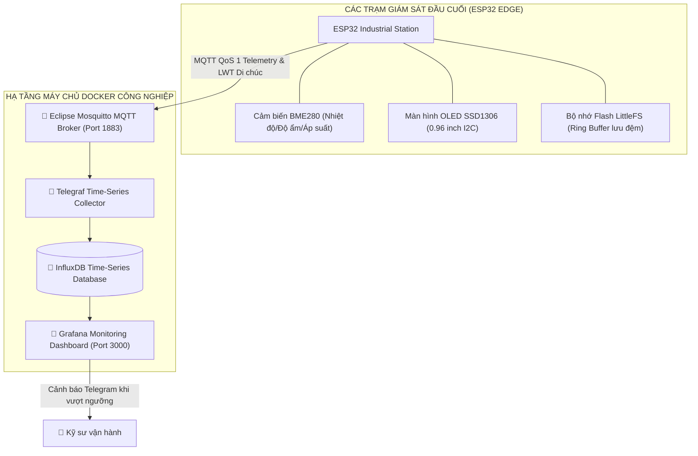
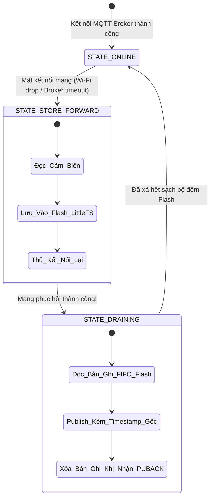

# 🏭 TRẠM GIÁM SÁT THIẾT BỊ CÔNG NGHIỆP QUA MQTT & STORE-AND-FORWARD
## Industrial IoT Device Monitoring Agent with High-Reliability Store-and-Forward and OTA

[](https://github.com/NguyenHoangUy1305/esp32-mqtt-device-monitoring/actions/workflows/ci.yml)
[](https://github.com/NguyenHoangUy1305/esp32-mqtt-device-monitoring)
[](LICENSE)

> **Tên đề tài:** Thiết kế trạm giám sát thiết bị công nghiệp sử dụng vi điều khiển ESP32 và giao thức MQTT, tích hợp cơ chế lưu đệm chống mất dữ liệu (Store-and-Forward) và cập nhật phần mềm từ xa (FOTA)  
> **Tác giả:** Kỹ sư IoT & Hệ thống nhúng (NguyenHoangUy1305)  
> **Thời gian:** Tháng 03/2027 - Tháng 04/2027  
> **Trọng tâm:** Độ tin cậy cấp công nghiệp (High Reliability), giải quyết triệt để bài toán đứt mạng vô tuyến và vận hành liên tục 24/7.

---

> 📘 **TÀI LIỆU KỸ THUẬT & LÝ THUYẾT ĐẦY ĐỦ:** Xem chi tiết toàn bộ lý thuyết MQTT, QoS 0/1/2, LWT, FOTA Dual Partition và sơ đồ kỹ thuật tại [`docs/SO_DO_KY_THUAT_VA_LY_THUYET.md`](./docs/SO_DO_KY_THUAT_VA_LY_THUYET.md).

---

## 1. SƠ ĐỒ KIẾN TRÚC HẠ TẦNG DOCKER & IOT



---

## 2. BẢNG ĐẤU NỐI CHÂN PHẦN CỨNG (PINOUT)

| Module / Thiết bị | Chân Module | Chân kết nối ESP32 | Điện áp | Chức năng kỹ thuật |
| :--- | :--- | :--- | :--- | :--- |
| **Cảm biến BME280** | **VCC** | **3V3** | 3.3V DC | Cấp nguồn cảm biến môi trường |
| | **GND** | **GND** | 0V | Nối mass chung |
| | **SCL** | **GPIO 22** | 3.3V (Kéo $4.7\text{k}\Omega$) | Bus $I^2C$ Clock |
| | **SDA** | **GPIO 21** | 3.3V (Kéo $4.7\text{k}\Omega$) | Bus $I^2C$ Data |
| **Màn hình OLED 0.96**| **VCC** | **3V3** | 3.3V DC | Cấp nguồn OLED SSD1306 |
| | **SCL / SDA** | **GPIO 22 / 21**| 3.3V (Dùng chung bus) | Hiển thị thông số thời gian thực |
| **Relay Cảnh Báo** | **VCC / IN** | **5V / GPIO 18** | 5V DC / 3.3V Logic | Kích hoạt còi/quạt công nghiệp |
| **Nút Nhấn Config** | **Chân 1** | **GPIO 0** | PULLUP nội | Nút đa năng chuyển chế độ AP cấu hình |
| **LED Báo Mạng** | **Anode (+)** | **GPIO 2** | 3.3V qua $220\Omega$ | Báo trạng thái kết nối MQTT Broker |

---

## 3. CƠ CHẾ LƯU ĐỆM CHỐNG MẤT DỮ LIỆU (STORE-AND-FORWARD)



---

## 4. HƯỚNG DẪN KHỞI CHẠY NHANH (QUICK START)
```bash
# 1. Khởi chạy cụm dịch vụ Docker (Mosquitto + InfluxDB + Grafana)
cd docker
docker-compose up -d

# 2. Kiểm tra log của Mosquitto Broker
docker-compose logs -f mosquitto

# 3. Biên dịch và nạp Firmware ESP32
cd ../firmware
pio run --target upload
```
