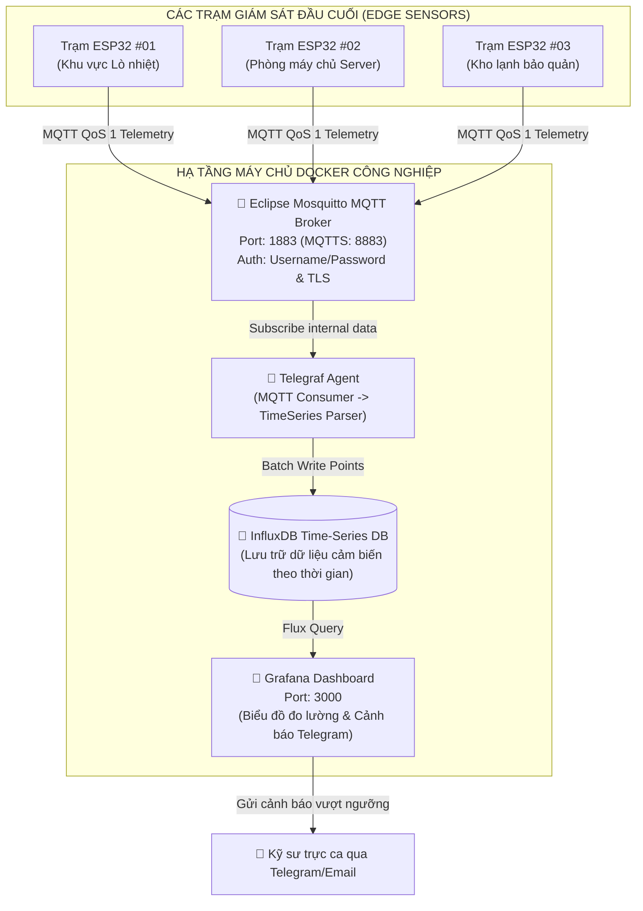
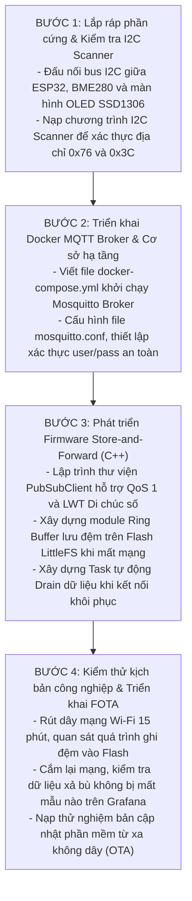
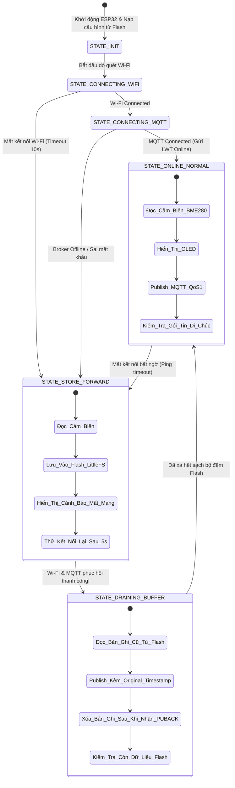

# 📘 SỔ TAY KỸ THUẬT CHUYÊN SÂU: SƠ ĐỒ KỸ THUẬT, SƠ ĐỒ QUY TRÌNH & CƠ SỞ LÝ THUYẾT
## Đề tài: Trạm giám sát thiết bị công nghiệp qua MQTT & Store-and-Forward (ESP32 + Mosquitto + Docker)

> **Tác giả:** Kỹ sư IoT & Hệ thống nhúng (NguyenHoangUy1305)  
> **Repository:** [NguyenHoangUy1305/esp32-mqtt-device-monitoring](https://github.com/NguyenHoangUy1305/esp32-mqtt-device-monitoring)  
> **Mục đích:** Tài liệu này cung cấp toàn bộ cơ sở lý thuyết chuyên sâu về giao thức MQTT chuẩn công nghiệp, cơ chế lưu đệm Store-and-Forward chống mất mát dữ liệu khi đứt mạng, kiến trúc nạp firmware từ xa không dây (OTA), sơ đồ nối dây phần cứng và quy trình thực hiện dự án.

---

## MỤC LỤC
1. [PHẦN 1: CƠ SỞ LÝ THUYẾT & NGUYÊN LÝ HOẠT ĐỘNG CHUYÊN SÂU](#phần-1-cơ-sở-lý-thuyết--nguyên-lý-hoạt-động-chuyên-sâu)
   - 1.1 Giao thức MQTT (OASIS Standard) & Mô hình Pub/Sub tách ghép
   - 1.2 Cấu trúc gói tin nhị phân MQTT & So sánh hiệu năng với HTTP
   - 1.3 Phân tích chuyên sâu 3 cấp độ QoS (Quality of Service)
   - 1.4 Cơ chế Keep-Alive & Khắc phục kết nối TCP Half-Open
   - 1.5 Cơ chế Di chúc số (Last Will and Testament - LWT)
   - 1.6 Khái niệm Retained Message & Persistent Session
   - 1.7 Cơ chế lưu đệm công nghiệp Store-and-Forward
   - 1.8 Bus truyền thông I2C & Thuật toán đọc cảm biến BME280
   - 1.9 Cơ chế nạp Firmware từ xa FOTA & Cấu trúc phân vùng Dual Partition
2. [PHẦN 2: SƠ ĐỒ KỸ THUẬT & SƠ ĐỒ ĐẤU NỐI MẠCH (PINOUT)](#phần-2-sơ-đồ-kỹ-thuật--sơ-đồ-đấu-nối-mạch-pinout)
   - 2.1 Bảng ánh xạ chân GPIO chi tiết (Hardware Pinout Matrix)
   - 2.2 Sơ đồ nguyên lý mạch điện phần cứng (Hardware Schematics)
   - 2.3 Sơ đồ kiến trúc hạ tầng Docker & Broker công nghiệp
3. [PHẦN 3: SƠ ĐỒ LÀM & SƠ ĐỒ QUY TRÌNH THỰC HIỆN DỰ ÁN](#phần-3-sơ-đồ-làm--sơ-đồ-quy-trình-thực-hiện-dự-án)
   - 3.1 Quy trình 4 bước triển khai thực chiến
   - 3.2 Sơ đồ máy trạng thái kết nối MQTT & Xử lý lưu đệm (State Machine)
   - 3.3 Sơ đồ tuần tự luồng dữ liệu & Cơ chế Drain Buffer (Sequence Diagram)

---

# PHẦN 1: CƠ SỞ LÝ THUYẾT & NGUYÊN LÝ HOẠT ĐỘNG CHUYÊN SÂU

### 1.1. Giao thức MQTT (OASIS Standard) & Mô hình Pub/Sub tách ghép
MQTT (**Message Queuing Telemetry Transport**) là giao thức truyền thông theo mô hình **Publish / Subscribe** chạy trên nền tảng mạng TCP/IP, được thiết kế tối ưu riêng cho các thiết bị nhúng có tài nguyên bộ nhớ hạn chế và hoạt động trong môi trường mạng vô tuyến băng thông thấp, độ trễ cao hoặc chập chờn.

* **Tính chất tách ghép 3 chiều vượt trội:**
  1. **Tách ghép không gian (Space Decoupling):** Thiết bị phát dữ liệu (Publisher - ESP32) và thiết bị nhận (Subscriber - Dashboard/Database) không cần biết địa chỉ IP hay port của nhau, chỉ cần kết nối tới cùng một **MQTT Broker** trung tâm.
  2. **Tách ghép thời gian (Time Decoupling):** Thiết bị gửi và thiết bị nhận không cần phải online cùng một thời điểm (khi kết hợp với Persistent Session và Retained Message).
  3. **Tách ghép đồng bộ (Synchronization Decoupling):** Quá trình gửi và nhận diễn ra bất đồng bộ, luồng xử lý chính của vi điều khiển không bị chặn lại khi chờ ứng dụng đầu cuối đọc tin.

---

### 1.2. Cấu trúc gói tin nhị phân MQTT & So sánh hiệu năng với HTTP

```text
+-----------------------+-----------------------+-------------------------------+
| Fixed Header (2 Bytes)| Variable Header (Opt) | Payload (Dữ liệu thực tế)     |
+-----------------------+-----------------------+-------------------------------+
| Byte 1: Type & Flags  | Packet Identifier,    | JSON / Binary Telemetry Data  |
| Byte 2: Remaining Len | Topic Name, Properties| {"temp": 28.5, "hum": 65.2}   |
+-----------------------+-----------------------+-------------------------------+
```

* **So sánh kỹ thuật giữa HTTP/REST và MQTT:**

| Tiêu chí kỹ thuật | HTTP / REST API | MQTT 3.1.1 / 5.0 | Đánh giá cho IoT Công Nghiệp |
| :--- | :--- | :--- | :--- |
| **Kích thước Header tối thiểu** | $200 \sim 800\text{ bytes}$ (Headers, User-Agent, Cookies) | **Chỉ $2\text{ bytes}$** | MQTT tiết kiệm tới **99% băng thông mạng** |
| **Duy trì kết nối** | Đóng socket sau mỗi request (hoặc Keep-Alive ngắn) | Duy trì **1 kết nối TCP duy nhất** | Giảm thiểu số lần bắt tay 3 bước TCP 3-way handshake |
| **Tiêu thụ điện năng vi điều khiển** | Cao (Liên tục mở kết nối SSL/TLS mới) | Cực thấp (Chỉ gửi frame nhị phân nhỏ) | Kéo dài tuổi thọ nguồn pin/ắc-quy |
| **Bản chất truyền tin** | Kéo dữ liệu (Pull / Polling) | Đẩy dữ liệu thời gian thực (Push) | Cảnh báo sự cố tức thì trong $< 20\text{ ms}$ |

---

### 1.3. Phân tích chuyên sâu 3 cấp độ QoS (Quality of Service)
* **QoS 0 (At most once - Tối đa một lần):**
  - Cơ chế: "Bắn rồi quên" (Fire and Forget). Gói tin gửi đi một chiều từ Client tới Broker mà không yêu cầu phản hồi xác nhận.
  - Ứng dụng: Dữ liệu đo đạc nhiệt độ/độ ẩm định kỳ mỗi 5 giây. Nếu mất một gói tin, gói tiếp theo sau 5 giây sẽ bù đắp mà không gây tổn hại cho hệ thống.
* **QoS 1 (At least once - Ít nhất một lần):**
  - Cơ chế: Client gửi gói `PUBLISH` kèm theo `Packet Identifier`. Broker bắt buộc phải gửi lại gói tin xác nhận `PUBACK`.
  - Xử lý mất mát: Nếu sau khoảng thời gian Timeout mà Client chưa nhận được `PUBACK`, nó sẽ tự động gửi lại gói tin với cờ trùng lặp `DUP = 1`.
  - Ứng dụng: Gửi các sự kiện quan trọng (Cảnh báo nhiệt độ vượt ngưỡng, trạng thái đóng mở máy bơm).
* **QoS 2 (Exactly once - Đúng một lần duy nhất):**
  - Cơ chế: Bắt tay 4 bước bảo mật cao cấp:
    1. Client gửi `PUBLISH`.
    2. Broker nhận và phản hồi `PUBREC` (Publish Received).
    3. Client gửi tiếp `PUBREL` (Publish Release) để giải phóng gói tin.
    4. Broker xác nhận hoàn tất bằng `PUBCOMP` (Publish Complete).
  - Đánh giá: Đảm bảo dữ liệu không bao giờ bị mất và không bao giờ bị xử lý trùng lặp. Tuy nhiên, nó tiêu tốn nhiều RAM của vi điều khiển và tăng độ trễ truyền thông gấp 3 lần.

---

### 1.4. Cơ chế Keep-Alive & Khắc phục kết nối TCP Half-Open
Trong môi trường công nghiệp có nhiều nhiễu sóng hoặc đường truyền 4G không ổn định, một socket TCP có thể bị đứt ngầm mà hệ điều hành không hề nhận được gói tin ngắt `FIN` hay `RST` (gọi là hiện tượng **TCP Half-Open Socket**).
* **Giải pháp MQTT Keep-Alive:**
  - Client cấu hình khoảng thời gian `KeepAlive = 30` giây.
  - Nếu trong vòng 30 giây không có dữ liệu cảm biến nào cần gửi, ESP32 sẽ chủ động gửi một gói tin nhịp tim siêu nhẹ (**PINGREQ** - 2 bytes).
  - Broker nhận được và lập tức phản hồi gói (**PINGRESP** - 2 bytes).
  - Nếu quá $1.5 \times \text{KeepAlive}$ (tức 45 giây) mà Broker không nhận được gói tin nào từ Client, Broker sẽ chủ động đóng kết nối và công bố sự cố!

---

### 1.5. Cơ chế Di chúc số (Last Will and Testament - LWT)
* Khi ESP32 thiết lập kết nối (`CONNECT`) tới Mosquitto Broker, nó đính kèm một "bản di chúc" đăng ký trước:
  - **LWT Topic:** `factory/station_01/status`
  - **LWT Payload:** `{"status": "OFFLINE", "reason": "unexpected_power_loss"}`
  - **LWT QoS:** 1
  - **LWT Retain:** `true`
* Nếu ESP32 hoạt động bình thường và tắt máy có chủ đích, nó sẽ gửi lệnh `DISCONNECT` an toàn, Broker sẽ hủy bản di chúc này.
* Nhưng nếu ESP32 bị sét đánh, mất nguồn 220V đột ngột, hoặc đứt cáp mạng: Broker phát hiện mất nhịp PING sẽ **tự động phát bản di chúc LWT** đến toàn bộ Dashboard và kỹ sư trực ca, giúp phát hiện thiết bị chết ngay tức thì!

---

### 1.6. Khái niệm Retained Message & Persistent Session
* **Retained Message:**
  Khi publish một tin nhắn kèm cờ `Retain = true`, Broker sẽ lưu trữ tin nhắn này lại trong bộ nhớ của nó như là trạng thái gần nhất (**Last Known Good Value**). Bất kỳ Dashboard hoặc ứng dụng nào vừa bật lên và subscribe vào topic này sẽ nhận được giá trị đó ngay tức thì mà không cần phải chờ tới chu kỳ lấy mẫu tiếp theo của cảm biến.
* **Persistent Session (CleanSession = false):**
  Broker ghi nhớ Client ID và lưu giữ toàn bộ danh sách topic đã subscribe cũng như các tin nhắn QoS 1/2 chưa kịp chuyển giao khi Client tạm thời ngắt kết nối.

---

### 1.7. Cơ chế lưu đệm công nghiệp Store-and-Forward
Một trạm giám sát công nghiệp đạt chuẩn không bao giờ được phép làm mất dữ liệu cảm biến khi mạng Internet bị đứt:
* **Kiến trúc Circular Ring Buffer trên bộ nhớ Flash (LittleFS/NVS):**
  - ESP32 được cấu hình vùng nhớ Flash riêng $512\text{ KB}$ làm kho lưu trữ đệm.
  - Khi `mqttClient.connected() == false`, luồng đo cảm biến vẫn tiếp tục lấy mẫu định kỳ đúng chu kỳ, đóng gói thành chuỗi JSON nén kèm dấu thời gian thực (**Timestamp từ RTC hoặc chu kỳ SNTP**) và ghi tuần tự vào Flash.
* **Cơ chế Drainer (Bơm xả bù dữ liệu khi mạng phục hồi):**
  - Khi Wi-Fi và MQTT kết nối lại thành công, một Task chạy nền sẽ kích hoạt tiến trình xả đệm (**Buffer Drainer**).
  - Đọc các bản ghi từ Flash theo nguyên tắc **FIFO (First In, First Out)**, gửi lên topic lưu trữ kèm cờ `is_buffered: true` và `original_timestamp`.
  - Có cơ chế kiểm soát tốc độ (Rate Limiting) để không gửi ồ ạt làm tràn hàng đợi của Broker. Sau khi Broker xác nhận `PUBACK`, con trỏ Flash mới tăng lên và giải phóng bộ nhớ.

---

### 1.8. Bus truyền thông I2C & Cảm biến môi trường BME280
Cảm biến BME280 của Bosch Sensortec đo đồng thời 3 thông số: Nhiệt độ, Độ ẩm và Áp suất khí quyển.
* **Giao tiếp $I^2C$ (Inter-Integrated Circuit):**
  - Sử dụng 2 dây cực thu hở (Open-Drain): `SDA` (GPIO 21) và `SCL` (GPIO 22). Bắt buộc phải có 2 điện trở kéo lên nguồn $3.3\text{V}$ (Pull-up Resistors $4.7\text{ k}\Omega$).
  - Địa chỉ thiết bị mặc định: `0x76` (hoặc `0x77` khi nối chân SDO lên VCC).
* **Thuật toán bù trừ chính xác cao (Factory Calibration Compensation):**
  BME280 không trả về giá trị độ C trực tiếp mà trả về giá trị số ADC thô 20-bit. ESP32 phải đọc 24 thanh ghi hiệu chuẩn xuất xưởng (`calib_data`) từ ROM của cảm biến và áp dụng các công thức toán học số nguyên 32-bit của Bosch để bù trừ nhiệt độ nội vi và phi tuyến tính, đạt độ chính xác tới $\pm 0.5^\circ\text{C}$ và $\pm 3\%\text{ RH}$.

---

### 1.9. Cơ chế nạp Firmware từ xa FOTA & Cấu trúc phân vùng Dual Partition
Hệ thống cho phép nâng cấp phần mềm mà không cần cắm cáp USB (Firmware Over-The-Air - FOTA) qua HTTP/MQTT.

```text
SƠ ĐỒ BẢN ĐỒ BỘ NHỚ FLASH ESP32 (4MB):
+---------------+---------------+---------------+---------------+---------------+
| Bootloader    | Partition Tbl | NVS / LittleFS| App Slot 0    | App Slot 1    |
| (0x1000)      | (0x8000)      | (0x9000)      | (ota_0)       | (ota_1)       |
| 32 KB         | 4 KB          | 512 KB        | 1.5 MB        | 1.5 MB        |
+---------------+---------------+---------------+---------------+---------------+
```

* **Nguyên lý chuyển đổi an toàn A/B (Ping-Pong Rollback):**
  1. Giả sử vi điều khiển đang chạy firmware trên `ota_0`.
  2. Khi có bản cập nhật mới, ESP32 tải luồng nhị phân và ghi đè tuần tự vào phân vùng `ota_1`.
  3. Kiểm tra mã băm SHA-256 toàn vẹn của file tải về.
  4. Nếu hợp lệ, ghi cờ vào phân vùng `otadata` thông báo cho Bootloader chuyển quyền khởi động sang `ota_1` ở lần khởi động tới.
  5. **Tính năng chống "biến thiết bị thành cục gạch" (Anti-Bricking Protection):**
     Khi boot vào firmware mới, nếu trong vòng 30 giây chương trình bị crash liên tục do lỗi Watchdog hoặc không kết nối được Wi-Fi, Bootloader sẽ **tự động hoàn tác (Rollback)** trở lại phân vùng `ota_0` cũ an toàn!

---

# PHẦN 2: SƠ ĐỒ KỸ THUẬT & SƠ ĐỒ ĐẤU NỐI MẠCH (PINOUT)

### 2.1. Bảng ánh xạ chân GPIO chi tiết (Hardware Pinout Matrix)

| Module / Linh kiện | Chân Module | Chân kết nối ESP32 | Điện áp hoạt động | Mô tả chức năng |
| :--- | :--- | :--- | :--- | :--- |
| **Cảm biến BME280** | **VCC** | **3V3** | 3.3V DC | Cấp nguồn cho cảm biến môi trường |
| | **GND** | **GND** | 0V | Nối mass chung |
| | **SCL** | **GPIO 22** | 3.3V (Kéo $4.7\text{k}\Omega$) | $I^2C$ Clock |
| | **SDA** | **GPIO 21** | 3.3V (Kéo $4.7\text{k}\Omega$) | $I^2C$ Data |
| **Màn hình OLED 0.96**| **VCC** | **3V3** | 3.3V DC | Cấp nguồn OLED SSD1306 |
| | **GND** | **GND** | 0V | Nối mass chung |
| | **SCL** | **GPIO 22** | 3.3V (Dùng chung bus) | $I^2C$ Clock |
| | **SDA** | **GPIO 21** | 3.3V (Dùng chung bus) | $I^2C$ Data |
| **Relay Cảnh Báo** | **VCC** | **VIN (hoặc 5V)** | 5V DC | Cấp nguồn nuôi cuộn hút relay |
| | **GND** | **GND** | 0V | Nối mass chung |
| | **IN** | **GPIO 18** | 3.3V Logic | Điều khiển bật quạt/còi công nghiệp |
| **Nút bấm Reset/Config**| **Chân 1** | **GPIO 0** | Kéo nội trở | Nút đa năng chuyển chế độ AP cấu hình |
| | **Chân 2** | **GND** | 0V | Nối mass khi bấm |
| **Đèn LED Báo Mạng** | **Anode (+)** | **GPIO 2** | 3.3V qua $220\Omega$ | Sáng ổn định = Có MQTT, Chớp = Đang reconnect |

---

### 2.2. Sơ đồ nguyên lý mạch điện phần cứng (Hardware Schematics)

```text
       +-------------------------------------------------------------+
       |           SƠ ĐỒ NGUYÊN LÝ MẠCH GIÁM SÁT CÔNG NGHIỆP         |
       +-------------------------------------------------------------+

                                      +3.3V
                                        │
                         ┌──────────────┴─────────────┐
                         │ [4.7kΩ]           [4.7kΩ]  │ (Điện trở kéo lên)
                         │   │                 │      │
                         │   │   GPIO 22 (SCL) ├───(SCL) BME280 (Addr: 0x76)
                         │   └───GPIO 21 (SDA) ┼───(SDA)    &
                         │                     │   (SCL) OLED 0.96 (Addr: 0x3C)
                         │                     └───(SDA)
                         │
     +5V NGUỒN           │   +-------------------------+
       │                 │   |    ESP32 DEVKIT V1      |
       ├─────────────────┴──>| VIN                 3V3 |────> Nguồn 3.3V nuôi Sensors
       ├───(VCC) RELAY 5V    |                         |
       │   (IN) <────────────| GPIO 18          GPIO 2 |────>[220Ω]──>(+) LED MẠNG
       │   (GND)─────────────| GND                GND  |────> Mass chung
       │                     |                         |
       │                     | GPIO 0 ────────[NÚT CONFIG]───> (GND)
       │                     +-------------------------+
       │
     (GND)───────────────────────────────────────────────────> Mass chung
```

---

### 2.3. Sơ đồ kiến trúc hạ tầng Docker & Broker công nghiệp



---

# PHẦN 3: SƠ ĐỒ LÀM & SƠ ĐỒ QUY TRÌNH THỰC HIỆN DỰ ÁN

### 3.1. Quy trình 4 bước triển khai thực chiến



---

### 3.2. Sơ đồ máy trạng thái kết nối MQTT & Xử lý lưu đệm (State Machine)



---

### 3.3. Sơ đồ tuần tự luồng dữ liệu & Cơ chế Drain Buffer (Sequence Diagram)

```mermaid
sequenceDiagram
    autonumber
    participant Sensor as BME280 / I2C
    participant ESP32 as Vi điều khiển ESP32
    participant Flash as Bộ nhớ Flash LittleFS
    participant Broker as Mosquitto Broker
    participant Grafana as Grafana Dashboard

    loop Chu kỳ 5 giây (Bình thường - Online)
        Sensor->>ESP32: Đọc nhiệt độ, độ ẩm thô qua I2C
        ESP32->>ESP32: Tính toán bù trừ chuẩn Bosch
        ESP32->>Broker: PUBLISH factory/station_01/telemetry (QoS 1)
        Broker-->>ESP32: PUBACK (Xác nhận thành công)
        Broker->>Grafana: Đẩy điểm dữ liệu lên biểu đồ thời gian thực
    end

    Note over ESP32,Broker: ⚡ Sự cố mạng: Wi-Fi bị ngắt kết nối!

    loop Chu kỳ 5 giây (Mất mạng - Store & Forward)
        Sensor->>ESP32: Đọc nhiệt độ, độ ẩm
        ESP32->>ESP32: Kiểm tra mqtt.connected() == false
        ESP32->>Flash: Ghi JSON nén + Timestamp RTC vào Ring Buffer
        Note right of Flash: Lưu trữ an toàn trong Flash,<br/>không sợ mất nguồn!
    end

    Note over ESP32,Broker: 🟢 Mạng phục hồi: Wi-Fi & MQTT kết nối lại!

    rect rgb(230, 245, 230)
    Note over ESP32,Broker: BẮT ĐẦU QUY TRÌNH XẢ ĐỆM (DRAINING BUFFER)
    loop Xả tuần tự các bản ghi cũ trong Flash (Rate-Limited)
        ESP32->>Flash: Đọc bản ghi FIFO cũ nhất
        ESP32->>Broker: PUBLISH { ...data, is_buffered: true, original_ts: 1711234500 }
        Broker-->>ESP32: PUBACK
        ESP32->>Flash: Xóa bản ghi đã gửi thành công
        Broker->>Grafana: Ghi bù dữ liệu vào trục thời gian quá khứ
    end
    end
